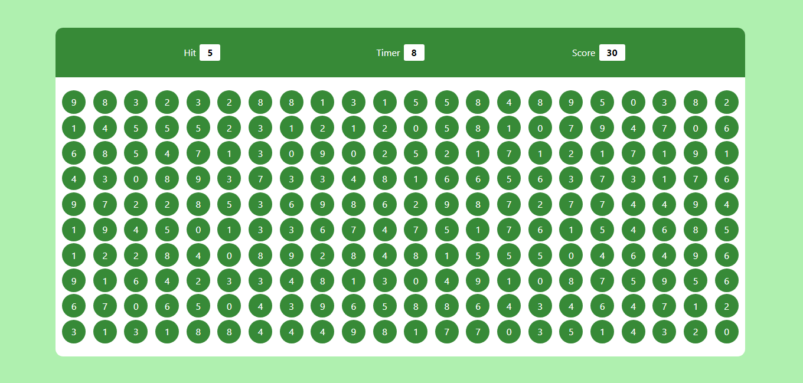

# Bubble Game

Welcome to the Bubble Game! This is a simple web-based game where you need to click on bubbles with the correct number to earn points. You have a limited amount of time to score as many points as possible. Can you beat your high score? Let's find out!

## Game Screenshot

## How to Play

1. When the game starts, a random number will appear at the top under "Hit."
2. Bubbles with random numbers will appear in the main panel.
3. Click on the bubbles that match the number displayed under "Hit."
4. If you click on the correct number, your score will increase by 10 points.
5. The timer counts down from 30 seconds. The game ends when the timer reaches 0.

## Game Elements

- **Hit**: This displays the number you need to hit in the bubbles.
- **Timer**: It shows the remaining time to play the game.
- **Score**: Your current score will be displayed here.

## Gameplay

- You can click on the bubbles to match the target number under "Hit."
- If you click the correct number, you earn 10 points.
- The game ends when the timer runs out, and your score is displayed.

## Getting Started

1. Clone or download this repository to your computer.
2. Open the `index.html` file in your web browser to play the game.

Have fun playing the Bubble Game! Try to beat your high score and challenge your friends to see who can score the most points. Good luck!

## Developer's Notes

The code for this game is provided in the HTML, CSS, and JavaScript files. Feel free to explore and modify the code to customize the game or learn from it.

Enjoy the game!
